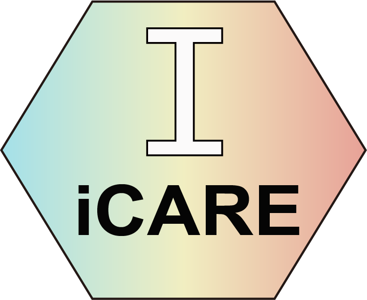

{fig-alt="icare package logo" width=180}

## About icare

`icare` is a modular R framework for clinical statistics and clinlabomics research. It connects data quality control, missing-data handling, feature selection, supervised learning, unsupervised patient subtyping, and survival modeling in one reproducible workflow. The package also provides model interpretation, nomograms, decision-curve analysis, and interactive deployment tools.

The framework is built around four S4 analysis objects. Each object records both the current data and the fitted workflow state—including imputation values, scaling parameters, selected features, and trained models—so that the same transformations can be replayed consistently for external cohorts or new patients.

```{mermaid}
flowchart LR
  A[Clinical or omics data] --> B[CreateStatObject]
  B --> C[Stat]
  C --> D[Train_Model]
  C --> E[Subtyping]
  C --> F[PrognosiX]
  D --> G[ModelDeployment]
  E --> H[New_Sub_Manager]
  F --> I[New_Prog_Manager]
```

## What This Book Covers

| Module | Core object | Main tasks |
|---|---|---|
| 1. Data cleaning and exploration | `Stat` | Type detection, missing-value imputation, outlier handling, encoding, normalization, differential features, visualization, and Table 1 |
| 2. Classification modeling | `Train_Model` | Feature selection, leakage-aware data splitting, model benchmarking, ensembles, tuning, explanation, clinical thresholds, and NRI/IDI |
| 3. Unsupervised subtyping | `Subtyping` | K-means, NMF, latent profile analysis, cluster validation and agreement, marker discovery, t-SNE/UMAP, and subtype deployment |
| 4. Survival and prognosis | `PrognosiX` | Cox and machine-learning survival models, feature selection, risk stratification, validation, nomograms, calibration, decision curves, and deployment |

Each module contains a concise quick-start chapter and a more complete advanced workflow. Module 4 also includes an extended PrognosiX chapter covering competing risks, repeated cross-validation, time-dependent ROC comparison, multi-time calibration, Bayesian tuning, and external-validation diagnostics. Code is divided into small executable chunks, and important results and figures appear immediately below the chunk that creates them.

## Authors

The `icare` package is authored by Huaichao Luo, Fei Long, Hongyan Lin, Jian Huang, and Guangchuang Yu. Huaichao Luo is the package maintainer (`luohc@uestc.edu.cn`). Package development and issue tracking take place in the [YuLab-SMU/icare repository](https://github.com/YuLab-SMU/icare).

## Installation

Install the current development version from GitHub:

```{r}
#| eval: false
install.packages("remotes")
remotes::install_github("YuLab-SMU/icare", dependencies = TRUE)
```

Some workflows use Bioconductor packages. If `ComplexHeatmap` is unavailable, install it separately:

```{r}
#| eval: false
install.packages("BiocManager")
BiocManager::install("ComplexHeatmap")
```

## How to Read the Tutorial

Start with [Before You Begin](prerequisites.qmd), then choose a quick-start chapter for the shortest complete workflow. Move to the corresponding advanced chapter when you need broader model comparison, publication-oriented figures, clinical interpretation, or deployment. Replace the example paths, column names, outcome definitions, and analysis settings before applying any workflow to a new study.

## Citation and License

When using the package, cite:

> Luo H, Long F, Lin H, Huang J, Yu G. *icare: Intelligent ClinlAbomics Research Expedition*. R package version 1.0.1.

`icare` is distributed under the GPL-3 license. This tutorial follows the active development version of the official repository; consult the repository history and `NEWS.md` when exact version reproducibility is required.
